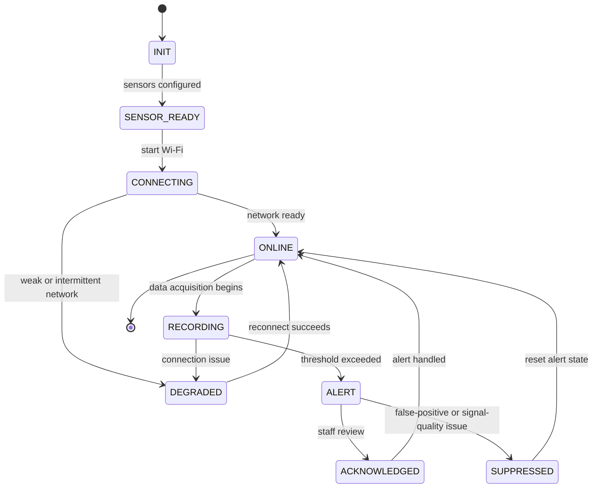
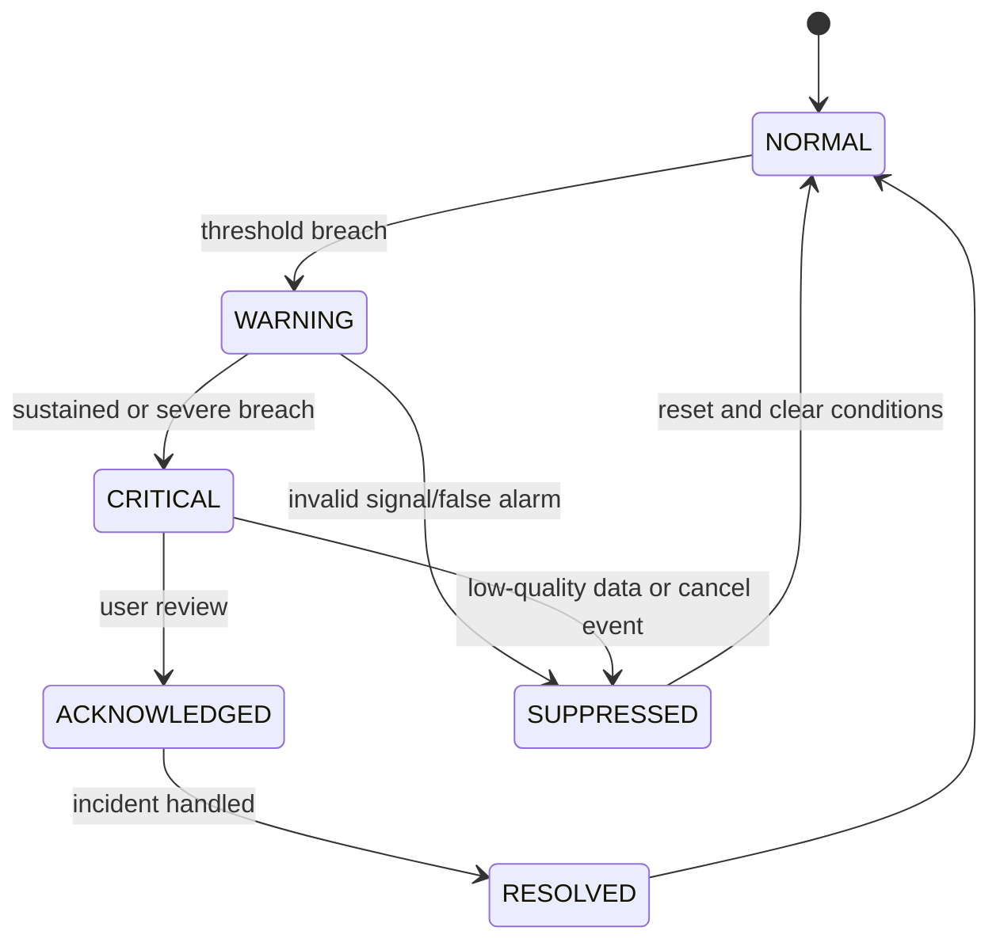

# VitalSense-Next: Application Flow and State Machine Specification

## 1. Purpose

This document specifies the runtime interaction flows for the VitalSense-Next system across the edge node, backend, and React.js dashboard. It describes user journeys, device state transitions, alert state progression, and critical monitoring logic.

---

## 2. High-Level User Flows

### 2.1 Device Setup Flow
1. staff or admin registers a new patient and device;
2. Arduino Uno R4 WiFi is assigned a device ID and patient mapping;
3. the firmware initializes sensors and connects to Wi-Fi;
4. backend confirms device registration and health status;
5. dashboard shows the device as online and active.

### 2.2 Monitoring Flow
1. device measures HR, SpO2, temperature, and motion;
2. filtered data is sent to backend;
3. database stores readings and computes summary statuses;
4. dashboard updates patient cards, trend charts, and alert boards.

### 2.3 Alert Flow
1. abnormal vitals or motion state trigger a risk condition;
2. backend creates a warning or critical alert event;
3. React.js dashboard highlights the patient row and alert pane;
4. assigned staff reviews the event and acknowledges it.

### 2.4 Emergency Escalation Flow
1. alert is escalated to critical state;
2. staff or guardian receives notification;
3. SOS flow triggers if required;
4. operational responders review status, location, and recent vitals.

---

## 3. Device State Machine

---

## 4. Alert State Machine

---

## 5. React.js Dashboard Flow

### 5.1 Home / Overview Screen
- patient status cards
- watch/warning/critical grouping
- alert count summary
- device health indicators

### 5.2 Patient Detail Screen
- recent HR and oxygen trends
- temperature and motion history
- event timeline
- ability to acknowledge and comment on alerts

### 5.3 Device Health View
- connectivity status
- battery life
- RSSI strength
- last-seen timestamps

---

## 6. Backend Workflow Logic

### 6.1 Telemetry Processing
1. FastAPI accepts packet
2. schema validation checks required keys
3. patient/device mapping is resolved
4. data is inserted into TimescaleDB
5. cached summary is updated in Redis
6. alert evaluation is triggered if threshold rules apply

### 6.2 Alert Evaluation Process
- compare inbound vitals against threshold table
- apply small confirmation windows to prevent spikes from generating false alarms
- update severity based on sustained condition
- push event to WebSocket stream for live dashboard updates

---

## 7. Admin and Staff Interaction Flows

### 7.1 Staff Login
- user enters credentials
- token is issued by FastAPI
- dashboard loads role-specific patient list
- user can filter by ward, device, or severity

### 7.2 Alert Review
- user clicks alert row
- patient details, vital trends, and timestamp are shown
- the user acknowledges or escalates the alert
- action is logged in audit history

### 7.3 Device Assignment
- admin links device to patient room or resident record
- device registration is stored in backend registry
- summary is shown in monitoring dashboard

---

## 8. Offline and Recovery Flows

### 8.1 Device Offline State
When the device loses Wi-Fi connectivity:
- keep local sensor loop operational;
- store recent packets in a small ring buffer;
- mark the device as degraded in backend status;
- retry transmission after reconnect.

### 8.2 Reconnect Sequence
1. Wi-Fi connection returns;
2. device uploads buffered payloads;
3. backend merges missing readings into the time-series store;
4. dashboard returns to online status without user intervention.

---

## 9. Acceptance Conditions

The app flow is accepted when:
- new device registration works end-to-end;
- telemetry appears in dashboard within acceptable delay;
- at least one alert can be acknowledged by staff;
- fall or critical threshold state is shown in triage order;
- offline and reconnect behaviors work without data loss for recent readings.

---

## 10. Summary

The application flow is designed so that the device, backend, and dashboard remain synchronized around a common set of health and alert states. The system supports normal monitoring, escalation, and offline recovery while remaining manageable for a final-year project implementation.
