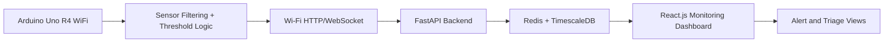

# VitalSense-Next: Product Requirements Document (PRD)

## 1. Document Control

- Project name: VitalSense-Next
- Project type: Edge-IoT biosignal telemetry and institutional health surveillance system
- Academic domain: Capstone / final-year engineering project
- Target institutional alignment: NSHM CSE Final Year Project, Annexure-II compliant
- Version: 1.1
- Date: 2026-09-09
- Status: Updated to the final selected stack (Arduino Uno R4 WiFi + React.js + FastAPI)

---

## 2. Executive Summary

VitalSense-Next is a cyber-physical health surveillance platform designed for campus hostels, elder-care facilities, and institutional care spaces where continuous monitoring is essential but conventional bedside systems are too expensive, too rigid, or unsuitable for ambulatory environments. The system combines a wearable sensing node built around the Arduino Uno R4 WiFi, MAX30102 pulse oximeter, DS18B20 temperature sensor, and MPU-6050 inertial measurement unit with a React.js monitoring dashboard and a FastAPI-based backend for real-time monitoring, alerting, and analytics.

The product addresses a clear operational gap: critical patient deterioration events such as severe tachycardia, sleep-time hypoxemia, fever spikes, and falls often go unnoticed outside clinical supervision until they become acute. Consumer wearables are closed ecosystems with limited raw telemetry access, whereas clinical monitors are bulky and tethered. VitalSense-Next fills this gap with a low-cost, open, and extensible monitoring mesh that supports real-time sensing, threshold-based alerting, trend review, and fast caregiver escalation.

---

## 3. Product Vision

The vision of VitalSense-Next is to provide a dependable, low-cost, edge-to-cloud health surveillance platform that helps institutions detect deterioration early and respond in time. The system is built around a practical architecture: Arduino Uno R4 WiFi at the edge, React.js for operational monitoring, FastAPI for telemetry ingestion and business logic, and TimescaleDB/Redis for analytics and alerting.

The product is expected to:

- continuously capture heart rate, SpO2, and temperature in a real-world institutional setting;
- detect abnormal physiologic and motion conditions in near real time;
- raise alerts through institutional dashboards without excessive false alarms;
- support reliable monitoring during intermittent connectivity;
- preserve trust through secure authentication and auditable event history.

---

## 4. Problem Definition

### 4.1 Current pain points

1. Critical deterioration often remains undetected during late-night or low-staffing periods.
2. Conventional bedside monitors are unavailable or impractical in hostel and community-care contexts.
3. Consumer devices are closed ecosystems and do not support institutional workflow needs.
4. Staff need a prioritization system, not just raw readings.
5. Alert workflows are often manual and delayed.
6. Privacy, auditability, and role-based access are essential but underdeveloped in prototype systems.

### 4.2 Target problem statement

Institutional caregivers lack a low-cost, continuous, context-aware monitoring ecosystem that can detect abnormal health signals, flag risk states, and escalate incidents through secure, role-aware dashboards.

---

## 5. Product Objectives

### 5.1 Primary objectives

- Continuous measurement of heart rate, blood oxygen saturation, and body temperature from a low-power wearable sensor node.
- Early risk detection using physiologic thresholds and motion-based fall logic.
- Real-time delivery of telemetry from the Arduino to the FastAPI backend and React.js dashboard.
- Secure and actionable alerting for wardens, caregivers, and medical staff.
- Operational resilience under intermittent Wi-Fi connectivity.

### 5.2 Secondary objectives

- Build a system that demonstrates edge computing, cloud ingestion, and analytics in a healthcare IoT context.
- Produce technically rigorous project artifacts suitable for academic evaluation and practical demonstration.
- Maintain extensibility for later mobile or patient-facing enhancements.

---

## 6. Product Scope

### 6.1 In scope

- Wearable sensor node with PPG, temperature, and IMU acquisition
- Wi-Fi-based telemetry transfer from Arduino Uno R4 WiFi to FastAPI backend
- React.js dashboard for health monitoring and triage
- Time-series analytics and alert evaluation using Redis and TimescaleDB
- Role-based dashboard access for medical staff, wardens, and administrators
- Local buffering and re-sync support during temporary connectivity loss

### 6.2 Out of scope for MVP

- Formal clinical certification or regulated medical-device approval
- Large multi-hospital deployment
- Automatic disease diagnosis
- Integration with institutional ERP/EHR beyond export-ready summaries
- Large-scale OTA firmware management in phase 1

---

## 7. Stakeholders and Personas

### 7.1 Stakeholder map

| Stakeholder | Needs | Primary concern |
| --- | --- | --- |
| Patient / Resident | Continuous monitoring, reassurance, incident awareness | Comfort, privacy, reliability |
| Guardian / Family member | Timely alerting and trend visibility | Delayed communication, false alarms |
| Campus warden / Staff | Awareness and quick escalation | Fast access and clear triage |
| Attending medical staff | Triage, trend review, event context | Accuracy, latency, clarity |
| System administrator | Device health and account security | Stability and operational trust |
| Academic reviewer | Technical completeness and engineering traceability | Demonstrable architecture rigor |

### 7.2 Persona definitions

#### Persona A: Student resident / monitored patient
- Needs: low-friction monitoring, clear alert states, and confidence that alerts are meaningful.
- Goals: comfort, reliability, minimal intervention.

#### Persona B: Guardian / caregiver
- Needs: immediate visibility during high-risk conditions.
- Goals: receive actionable event information and recent trend context.

#### Persona C: Medical staff / nurse / resident doctor
- Needs: prioritized risk list and reviewable telemetry history.
- Goals: quickly identify abnormal patients and review prior events.

#### Persona D: Campus warden / emergency coordinator
- Needs: facility-wide situational awareness and escalation support.
- Goals: know which residents are critical and where to respond.

#### Persona E: System administrator
- Needs: device registration, user role management, and deployment health visibility.
- Goals: maintain healthy and secure operation.

---

## 8. User Needs and Value Proposition

Users need a system that detects physiologic deterioration or falls quickly and communicates the event in a clear, actionable, low-noise way. VitalSense-Next provides an integrated health monitoring mesh using a low-cost embedded sensor node, Wi-Fi telemetry, and an institutional risk dashboard.

---

## 9. Functional Requirements

### 9.1 Core sensor functions

#### FR-01: Sensor acquisition
- The wearable node shall acquire PPG signals from MAX30102 at approximately 100 Hz.
- The DS18B20 shall provide temperature readings at approximately 1 Hz.
- The MPU-6050 shall sample motion and tilt data for fall and posture analysis.

#### FR-02: Signal processing and health estimation
- The firmware shall filter and smooth PPG data before estimating heart rate and oxygen saturation.
- The system shall calculate heart rate, SpO2, body temperature, and motion status.

#### FR-03: Alert thresholding
- The system shall compare vitals against configured thresholds for high HR, low HR, low oxygen, and fever.
- Alerts shall be generated only after confirmation logic or sustained threshold exceedance.

#### FR-04: Fall detection
- The system shall detect sudden acceleration or impact followed by inactivity.
- It shall support a predefined grace period and alert cancellation flow.

#### FR-05: Telemetry transmission
- The Arduino Uno R4 WiFi shall transmit JSON telemetry to the FastAPI backend over Wi-Fi using HTTP or WebSocket.
- The device shall buffer recent readings locally if the network is unstable.

#### FR-06: Dashboard and monitoring
- The React.js dashboard shall display vitals, trends, and current risk state for each monitored resident.
- Staff shall be able to review patient timelines and device health information.

#### FR-07: Security and access
- The platform shall enforce authenticated access and role-based permissions.
- Sensitive telemetry shall only be available to users with the appropriate institutional scope.

#### FR-08: Audit and reporting
- All alert actions, exports, and overrides shall be logged with timestamps and user identity.

### 9.2 Priority groups

| Priority | Meaning | Example requirements |
| --- | --- | --- |
| P0 | Core MVP | vitals, alerting, triage dashboard, device registration |
| P1 | Important | trend history, role control, audit logs |
| P2 | Future enhancement | advanced charts, richer exports, mobile extension |

---

## 10. Non-Functional Requirements

### 10.1 Performance
- Device-to-dashboard telemetry latency target: under 2 seconds in normal Wi-Fi conditions.
- Dashboard refresh target: under 1 second for active monitored residents.
- Sensor processing should not block Wi-Fi telemetry tasks.

### 10.2 Reliability
- The system shall handle brief connectivity loss and resume data transmission after re-connect.
- Local logs should persist recent telemetry for recovery and replay.

### 10.3 Scalability
- The architecture shall support multiple monitored devices in a single institutional deployment.
- The backend shall be suitable for growth through queueing and optimized time-series storage.

### 10.4 Security and privacy
- HTTPS and TLS 1.3 shall protect web traffic.
- JWT and refresh token rotation shall secure API access.
- Role-based access shall restrict patient data to the correct audience.

### 10.5 Usability
- Dashboard views shall minimize cognitive load and highlight emergencies clearly.
- Accessibility should target WCAG AA as baseline and AAA in key actions where feasible.

### 10.6 Maintainability
- Sensor, backend, and frontend modules shall remain modular and replaceable.
- The telemetry schema shall use versioned payload standards.

---

## 11. Functional Use Cases

### 11.1 Use case 1: continuous monitoring
Actor: monitored resident

Scenario: A resident wears the Arduino Uno R4 WiFi node through the night while the React.js dashboard monitors heart rate, temperature, and oxygen. The system records stable or abnormal conditions and updates the staff dashboard.

### 11.2 Use case 2: threshold alert escalation
Actor: medical staff / administrator

Scenario: A resident exceeds a defined threshold for several seconds; the backend raises a warning or critical event and the dashboard prioritizes it in the triage list.

### 11.3 Use case 3: fall detection
Actor: resident / staff

Scenario: The MPU-6050 detects a sudden spike and subsequent inactivity; the device raises a fall event and the alert panel shows a high-priority emergency state.

### 11.4 Use case 4: historical review
Actor: attending doctor

Scenario: A clinician reviews a patient’s 24-hour history of HR, SpO2, and temperature to determine whether the event is repeated or isolated.

---

## 12. MVP Scope Definition

### 12.1 MVP core features
1. Arduino Uno R4 WiFi sensor node with MAX30102, DS18B20, and MPU-6050 acquisition.
2. Arduino signal filtering and threshold logic for HR, SpO2, temperature, and falls.
3. Wi-Fi telemetry to the FastAPI backend.
4. React.js dashboard with live vitals and risk summary.
5. Alert generation with staff-facing dashboard updates.
6. Role-based administrative access and basic audit logging.

### 12.2 Exit criteria
The MVP is complete when:

- data from all sensors is visible in the backend and dashboard;
- at least one critical alert is correctly generated and displayed;
- the dashboard prioritizes abnormal patients correctly;
- the system recovers cleanly after brief network disruption;
- the architecture is clearly validated through demo and testing.

---

## 13. Product Metrics and KPI Goals

### 13.1 Technical metrics
- Device-to-dashboard latency: under 2 seconds in normal Wi-Fi operation
- Data completeness: above 95% for active monitored periods
- Dashboard refresh: under 1 second for the active patient list
- System uptime: above 99% in lab demonstration conditions

### 13.2 Clinical workflow metrics
- Critical alert acknowledgment: target > 90% within 1 minute in test scenarios
- False alert rate: maintain under 10% under typical non-critical motion

### 13.3 Success criteria
- All P0 requirements implemented and verified
- Project showcase end-to-end flow works in a realistic demonstration environment

---

## 14. Constraints and Assumptions

### 14.1 Technical constraints
- The Uno R4 WiFi has limited SRAM and flash compared to ESP32-class boards.
- Practical signal quality depends on motion compensation and calibration.
- Wi-Fi stability is a deployment constraint for edge reporting.

### 14.2 Operational assumptions
- Staff have access to the web dashboard and are responsible for acting on escalations.
- Device location and sensor placement are handled by institutional staff.
- The system is an early-warning aid, not a replacement for clinical diagnosis.

---

## 15. Dependencies

### 15.1 Hardware dependencies
- Arduino Uno R4 WiFi
- MAX30102
- DS18B20
- MPU-6050
- LiPo battery and regulator

### 15.2 Software dependencies
- React.js (dashboard)
- FastAPI backend
- Redis cache
- TimescaleDB for time-series telemetry
- WebSocket/HTTP ingestion stack

---

## 16. Risks and Mitigation

| Risk | Impact | Likelihood | Mitigation |
| --- | --- | --- | --- |
| Motion artifact causes false HR or SpO2 alarms | High | Medium | filtering and confidence check |
| Wi-Fi dropout interrupts telemetry | Medium | Medium | local buffering and retry |
| False fall detection | High | Medium | grace window and inactivity confirmation |
| Sensor drift | Medium | Medium | calibration and placement guidelines |
| Privacy concerns | High | Low | RBAC and secure API access |

---

## 17. Acceptance Criteria

The product is ready for MVP validation when:

1. Arduino sensors produce valid HR, oxygen, temperature, and motion values.
2. The backend reliably ingests telemetry from the device.
3. The React.js dashboard displays risk state and trend history.
4. Alert logic triggers correctly under simulated stress conditions.
5. Authentication, role access, and audit logging work as expected.

---

## 18. Conclusion

VitalSense-Next is a practical, academically rigorous healthcare IoT system built around the Arduino Uno R4 WiFi and a modern web stack. By combining sensing, telemetry, analytics, and triage workflows, it addresses the real need for low-cost early-warning monitoring in institutional environments. The selected stack keeps the system realistic, workable, and demonstrable within the capstone timeline while retaining strong engineering depth and future expansion potential.

---

## 19. Appendix A: Example threshold configuration

| Metric | Normal range | Warning threshold | Critical threshold |
| --- | --- | --- | --- |
| Heart rate | 60-100 BPM | >110 BPM or <50 BPM | >130 BPM or <45 BPM |
| SpO2 | 95-100% | <94% | <90% |
| Temperature | 36.5-37.5°C | >37.8°C | >38.5°C |
| Fall detection | normal gait | acceleration spike | impact + inactivity |

### Appendix B: High-level system flow

