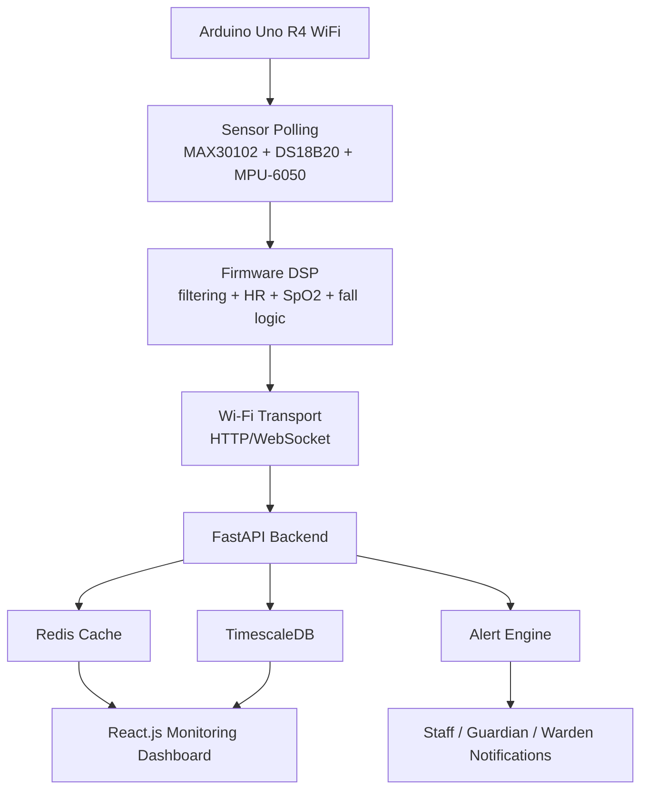

# VitalSense-Next: System Architecture

## 1. Overview

VitalSense-Next is an edge-to-cloud biosignal monitoring system. It combines real-time sensing on Arduino Uno R4 WiFi with cloud processing via FastAPI, storage in TimescaleDB, caching in Redis, and monitoring through a React.js dashboard.

The core architecture is organized into six layers:
1. Sensor acquisition layer
2. Edge processing and control layer
3. Network transport layer
4. Application and API layer
5. Data persistence and analytics layer
6. Monitoring and alerting layer

---

## 2. Architectural Goals

- low-power, low-cost biometric monitoring
- near real-time clinical visibility
- secure device-to-cloud telemetry
- resiliency during Wi-Fi interruptions
- clear separation of concerns across sensing, backend, and UI

---

## 3. High-Level System Components

### 3.1 Edge Device Layer
- Arduino Uno R4 WiFi
- MAX30102 for PPG and heart rate/SpO2
- DS18B20 for temperature
- MPU-6050 for motion and fall detection
- Local buffering and threshold logic

### 3.2 Transport Layer
- Wi-Fi communication using HTTP and/or WebSocket
- JSON telemetry packets with deviceId and timestamp
- retry and offline caching logic

### 3.3 API Layer
- FastAPI service for device registration, telemetry ingestion, auth, and alert retrieval
- Pydantic validation for schemas
- JWT authentication and RBAC middleware

### 3.4 Data Layer
- TimescaleDB for time-series telemetry and event history
- Redis for live state, alert cache, and ephemeral session management

### 3.5 Presentation Layer
- React.js dashboard for summary cards, charts, triage ordering, alerts, and staff actions

---

## 4. Architectural Diagram



---

## 5. Detailed Layer Description

### 5.1 Sensor Acquisition Layer
The edge node continuously reads:
- red/IR photoplethysmography from MAX30102;
- body temperature from DS18B20;
- accelerometer and gyro data from MPU-6050.

Data is timestamped and queued for signal processing before transmission.

### 5.2 Edge Processing Layer
Firmware responsibilities:
- baseline correction
- moving-average smoothing
- peak detection for heart rate estimation
- simple SpO2 approximation
- fall detection based on acceleration magnitude and inactivity
- threshold-based alert state generation

### 5.3 Network Layer
The Arduino shall send compact JSON telemetry over Wi-Fi. The backend shall validate ingestion and route to downstream systems.

Typical packet:
```json
{
  "deviceId": "VSN-UnoR4-001",
  "timestamp": 1725879123456,
  "type": "vital_stream",
  "payload": {
    "hr": 76.2,
    "spo2": 97.3,
    "tempC": 36.8,
    "quality": 91,
    "alertCode": 0
  }
}
```

### 5.4 Application Layer
FastAPI is responsible for:
- telemetry ingestion endpoints
- authentication and authorization
- patient/device registries
- alert and event state management
- analytics and dashboard response generation

### 5.5 Persistence and Analytics Layer
TimescaleDB stores time-series vitals as hypertable records for queries by time range, patient, or device. Redis stores session state, live status, and queue metadata for fast access.

### 5.6 Monitoring and Alerting Layer
The React.js dashboard presents:
- live vitals
- highlighted risk states
- triage ordering
- historical trends
- alert acknowledgment actions

---

## 6. Data Flow Behavior

### 6.1 Normal Monitoring Path
1. Arduino reads all sensors.
2. Firmware filters and computes metrics.
3. Telemetry packet is prepared and sent via Wi-Fi.
4. FastAPI validates and stores data.
5. React.js refreshes trend and alert views.

### 6.2 Alert Path
1. firmware detects threshold violation or fall pattern;
2. alert state is generated and queued;
3. FastAPI receives and persists the alert;
4. Redis and dashboard update immediately;
5. staff acknowledges or escalates the alert.

### 6.3 Offline Recovery Path
1. connection loss is detected;
2. device buffers recent readings locally;
3. backlog is retried when network returns;
4. backend replays or merges data without losing the latest readings.

---

## 7. System Interfaces

### 7.1 IoT Device to Backend
- HTTP POST to `/api/v1/telemetry`
- optional WebSocket streaming channel
- JSON payload schema defined in the API document

### 7.2 Backend to Frontend
- REST endpoints for patient summaries and alert history
- WebSocket channels for live monitoring updates

### 7.3 Frontend to Backend
- auth login
- patient filtering and dashboard queries
- alert acknowledgment actions

---

## 8. Security Architecture

- HTTPS/TLS 1.3 for backend communication
- JWT session management and refresh tokens
- RBAC for clinician, admin, warden, and guardian users
- sensitive patient data visible only to authorized roles
- audit logs for alert actions and report access

---

## 9. Reliability and Performance Design

### 9.1 Reliability
- local telemetry buffering on the Arduino during Wi-Fi interruption
- backend validation for malformed payload rejection
- Redis-based cache and deduplication to prevent repeated alert storms

### 9.2 Performance
- 100 Hz PPG sampling from MAX30102 is feasible but must be carefully scheduled on the Uno R4 WiFi
- dashboard displays should refresh using lightweight polling or Socket.IO/WebSocket updates
- time-series queries should use windows instead of full-table scans for trend views

---

## 10. Architectural Constraints

- limited memory on Arduino Uno R4 WiFi implies compact processing and buffering
- low-cost sensors require calibration and confidence filtering
- institutional deployment is not a clinical-grade certified environment
- user actions remain essential for emergency escalation, even when alerts are automated

---

## 11. Architectural Trade-offs

### 11.1 Why Arduino Uno R4 WiFi?
It is suitable for a capstone implementation because it offers onboard Wi-Fi, sufficient GPIO capability, and workable memory for sensor polling and telemetry tasks.

### 11.2 Why FastAPI?
FastAPI is a suitable backend choice for a compact but robust API layer with Pydantic validation and easy integration with Python-based data pipelines and analytics.

### 11.3 Why React.js?
The dashboard requires strong live-view capabilities, chart rendering, and role-aware component behavior, which React.js supports well.

---

## 12. Summary

The VitalSense-Next architecture is intentionally modular and realistic for an academic health IoT system. It prioritizes reliable edge sensing, secure cloud ingestion, and actionable institutional monitoring, while maintaining a clean separation between data acquisition, backend services, security, and user-facing dashboards.
