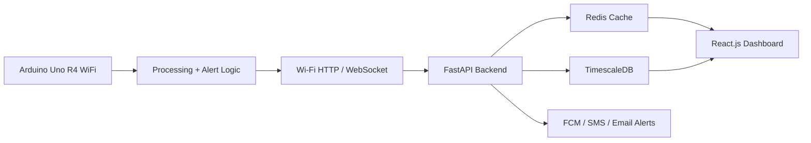
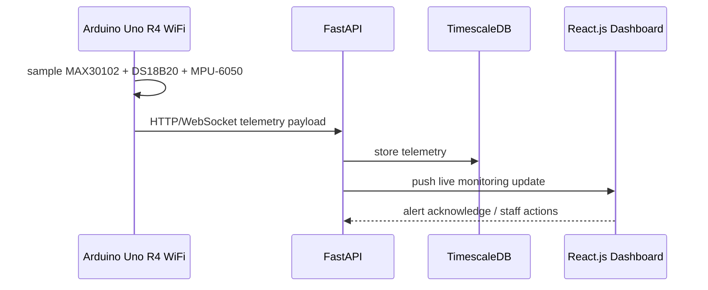

# VitalSense-Next: Technical Requirements Document (TRD)

## 1. Document Control

- Project: VitalSense-Next
- Type: Technical Requirements Specification
- Status: Updated to the selected final platform baseline
- Version: 1.1
- Date: 2026-09-09

---

## 2. Purpose and Scope

This document defines the technical requirements for the VitalSense-Next system using the selected implementation stack:

- Controller: Arduino Uno R4 WiFi
- Sensors: MAX30102, DS18B20, MPU-6050
- Frontend: React.js
- Backend: FastAPI
- Persistence: TimescaleDB + Redis

The specification covers end-to-end design from wearable acquisition to institutional monitoring and alerting.

---

## 3. System Context

VitalSense-Next is a cyber-physical health telemetry platform that acquires physiological and motion data from a wearable node, processes it at the edge, and sends stream metrics to a FastAPI backend. Institutional staff can then monitor patient status through a React.js dashboard and act on risk events in near real time.

### 3.1 High-level technical flow



---

## 4. Technical Objectives

- Acquire continuous PPG, temperature, and motion signals with low power and acceptable signal fidelity.
- Run lightweight signal processing on the Arduino Uno R4 WiFi.
- Send telemetry securely to FastAPI over Wi-Fi.
- Detect abnormal vitals and fall conditions using threshold logic.
- Persist telemetry in TimescaleDB for trend analysis and historical review.
- Expose a secure, role-aware monitoring workflow through React.js.

---

## 5. Hardware and Embedded Requirements

### 5.1 Target controller platform

- Model: Arduino Uno R4 WiFi
- CPU: Renesas RA4M1, 32-bit Arm Cortex-M4 at 48 MHz
- Memory: 256 KB SRAM
- Flash: 1 MB
- Wireless: onboard Wi-Fi for HTTP/WebSocket transmission
- Debug serial: USB serial at 115200 baud

### 5.2 Sensor mapping

#### MAX30102 pulse oximeter and heart-rate sensor
- Interface: I2C
- Typical I2C address: 0x57
- SDA: A4
- SCL: A5
- Supply: 3.3V
- Sampling target: 100 Hz

#### DS18B20 digital temperature sensor
- Interface: 1-Wire
- Data pin: D2 (recommended)
- Pull-up resistor: 4.7 kΩ to 3.3 V
- Supply: 3.3V
- Sampling target: 1 Hz

#### MPU-6050 inertial measurement unit
- Interface: I2C
- I2C address: 0x68
- SDA: A4
- SCL: A5
- Supply: 3.3V
- Sampling target: 50-100 Hz

### 5.3 Electrical constraints

- Use a shared I2C bus at 400 kHz for MAX30102 and MPU-6050.
- Keep sensor leads short and route away from noisy power traces.
- Place 100 nF decoupling capacitors near each sensor VDD pin.
- Keep a 1 µF bulk capacitor near the regulator output.
- Maintain a 4.7 kΩ pull-up on the DS18B20 line.

### 5.4 Embedded software requirements

- Arduino/C++ firmware running on Uno R4 WiFi
- Event loop with sensor polling and Wi-Fi transmit management
- Small ring buffer for recent samples during connectivity interruptions
- Memory-efficient algorithms due to 256 KB SRAM limitation

---

## 6. Embedded Firmware Technical Requirements

### 6.1 Core firmware responsibilities

1. Sensor acquisition and timing control
2. Filtering and signal quality checks
3. Heart-rate and SpO2 estimation
4. Motion-based fall detection
5. Alert state evaluation
6. Wi-Fi telemetry transmission
7. Local buffering during radio interruption

### 6.2 Arduino function signatures

```cpp
struct SensorConfig {
  uint32_t ppgSampleRateHz = 100;
  uint32_t tempSampleRateHz = 1;
  uint32_t imuSampleRateHz = 50;
  uint8_t max30102Address = 0x57;
  uint8_t mpu6050Address = 0x68;
  uint8_t ds18b20Pin = 2;
  uint32_t serialBaud = 115200;
};

struct VitalPacket {
  unsigned long timestampMs;
  float heartRateBpm;
  float spo2Percent;
  float temperatureC;
  float accelX;
  float accelY;
  float accelZ;
  float gyroX;
  float gyroY;
  float gyroZ;
  uint8_t signalQuality;
  uint8_t fallState;
  uint8_t alertCode;
};

class VitalSenseNode {
public:
  bool begin(const SensorConfig& config);
  void runLoop();
  void samplePpg();
  void sampleTemperature();
  void sampleImu();
  void processSignals();
  bool evaluateAlertState(const VitalPacket& packet);
  void transmitTelemetry(const VitalPacket& packet);
};
```

### 6.3 Processing loop model

| Function | Trigger | Responsibility |
| --- | --- | --- |
| `samplePpg()` | every 10 ms | read MAX30102 data |
| `sampleTemperature()` | every 1000 ms | read DS18B20 |
| `sampleImu()` | every 20 ms | read accelerometer and gyro |
| `processSignals()` | after sample batch | filter and estimate vitals |
| `evaluateAlertState()` | every second | check threshold logic |
| `transmitTelemetry()` | event-driven | send JSON payload over Wi-Fi |

---

## 7. Signal Processing Requirements

### 7.1 PPG requirements

The MAX30102 produces red and infrared signals. The firmware converts them into useful signal estimates and filters out motion noise.

#### Sampling target
- PPG sampling frequency: 100 Hz
- One red/IR sample pair every 10 ms

#### Filtering requirements
- DC offset removal or baseline tracking
- Moving-average smoothing
- Band-pass filtering in the pulse range
- Peak interval detection for pulse rate estimation

### 7.2 Heart-rate estimation

$$
HR_{BPM} = \frac{60}{\bar{T}_{beat}}
$$

where $\bar{T}_{beat}$ is the average interval between valid PPG peaks.

### 7.3 SpO2 estimation

$$
R = \frac{AC_{red}/DC_{red}}{AC_{ir}/DC_{ir}}
$$

$$
SpO_2 = a - bR
$$

where calibration constants $a$ and $b$ are tuned to the specific hardware pair.

### 7.4 IMU and fall detection

The MPU-6050 shall support fall detection by evaluating acceleration magnitude and inactivity.

$$
VMU = \sqrt{a_x^2 + a_y^2 + a_z^2}
$$

A fall candidate is declared when a high acceleration event is followed by a sustained low-motion state after a validation interval.

---

## 8. Communication Requirements

### 8.1 Wi-Fi transport

The Arduino Uno R4 WiFi shall transmit telemetry to the FastAPI backend over Wi-Fi using HTTP POST or WebSocket.

#### Recommended communication assumptions
- Wi-Fi mode: 802.11 b/g/n
- Local API endpoint: port 8000 in development builds
- Packet timeout: 2-5 seconds
- Payload format: compact JSON
- Serial debug: 115200 baud

### 8.2 Telemetry packet contract

```json
{
  "deviceId": "VSN-UnoR4-001",
  "timestamp": 1725879123456,
  "type": "vital_stream",
  "payload": {
    "hr": 76.2,
    "spo2": 97.3,
    "tempC": 36.8,
    "quality": 91,
    "alertCode": 0,
    "accel": { "x": 0.13, "y": -0.07, "z": 0.96 },
    "gyro": { "x": 5.2, "y": -2.1, "z": 8.7 }
  }
}
```

### 8.3 WebSocket events

- `/ws/monitoring` for live monitoring updates
- `/ws/alerts` for alert events
- `/ws/device-health` for connectivity and battery data

---

## 9. Backend and Data Requirements

### 9.1 FastAPI backend responsibilities

- Receive and validate telemetry payloads
- Authenticate via JWT
- Store readings in TimescaleDB
- Maintain session and alert queues in Redis
- Expose REST endpoints for dashboards and admin actions

### 9.2 TimescaleDB schema

```sql
CREATE TABLE devices (
  device_id UUID PRIMARY KEY,
  patient_id UUID,
  hw_model TEXT NOT NULL,
  firmware_version TEXT,
  last_seen TIMESTAMPTZ,
  battery_pct INTEGER,
  rssi_dbm INTEGER,
  created_at TIMESTAMPTZ DEFAULT NOW()
);

CREATE TABLE vital_readings (
  reading_id BIGSERIAL,
  device_id UUID REFERENCES devices(device_id),
  patient_id UUID,
  timestamp TIMESTAMPTZ NOT NULL,
  heart_rate REAL,
  spo2 REAL,
  temperature_c REAL,
  acceleration_x REAL,
  acceleration_y REAL,
  acceleration_z REAL,
  gyro_x REAL,
  gyro_y REAL,
  gyro_z REAL,
  signal_quality INTEGER,
  alert_code INTEGER,
  PRIMARY KEY (timestamp, device_id)
);
SELECT create_hypertable('vital_readings', 'timestamp', if_not_exists => TRUE);
```

### 9.3 API endpoints

| Method | Endpoint | Purpose |
| --- | --- | --- |
| POST | `/api/v1/telemetry` | Receive device data |
| GET | `/api/v1/devices/{id}/status` | Device health |
| GET | `/api/v1/patients/{id}/vitals` | Recent vitals |
| GET | `/api/v1/alerts` | Current and historical alerts |
| POST | `/api/v1/alerts/ack` | Acknowledge alert |
| POST | `/api/v1/sos/dispatch` | Trigger emergency workflow |

---

## 10. Frontend Requirements (React.js)

### 10.1 Functional frontend requirements

- Dashboard with monitored residents and severity badges
- Real-time trend views for HR, SpO2, and temperature
- Alert list with timestamps and acknowledgment actions
- Device health panel with RSSI and connection state
- Role-based access for staff and administrators

### 10.2 UI stack

- React.js
- Tailwind CSS
- Recharts or equivalent
- Fetch/Axios for API calls
- WebSocket client for live updates

---

## 11. Security and Privacy Requirements

- HTTPS/TLS 1.3 for all backend traffic
- JWT-based authentication with refresh-token rotation
- Role-based access control for staff, wardens, caregivers, and admins
- Audit log for alert acknowledgment and report generation
- Restrict access to patient telemetry by authorization scope

---

## 12. Performance and Scalability Requirements

### 12.1 Latency budget

| Stage | Target |
| --- | --- |
| Sensor acquisition | < 100 ms |
| Device send to backend | < 2 s under stable Wi-Fi |
| Dashboard refresh | < 1 s |
| Alert generation | < 3 s in normal conditions |

### 12.2 Reliability

- Temporary Wi-Fi loss should not drop the monitoring workflow
- Device logs should be buffered and retried after reconnect
- A connectivity error should be classified as degraded rather than silent data loss

---

## 13. Requirements Traceability Matrix

| Requirement ID | Requirement | Technical evidence |
| --- | --- | --- |
| TRD-01 | MAX30102 acquisition | I2C at A4/A5 with 100 Hz target |
| TRD-02 | DS18B20 temperature | 1-Wire on D2 with 4.7k pull-up |
| TRD-03 | MPU-6050 motion tracking | I2C on same bus |
| TRD-04 | Filtering | moving-average + band-pass processing |
| TRD-05 | Alert logic | firmware threshold and motion evaluation |
| TRD-06 | Telemetry upload | Wi-Fi HTTP/WebSocket to FastAPI |
| TRD-07 | Storage | TimescaleDB hypertables |
| TRD-08 | Monitoring UI | React.js dashboard |
| TRD-09 | Security | JWT + RBAC + TLS |

---

## 14. Acceptance Criteria

The system meets technical readiness when:

1. All three sensors run together without bus conflict.
2. HR, SpO2, temperature, and motion values are visible in the backend.
3. The React.js UI shows live dashboard updates and triage priority.
4. The backend stores readings in TimescaleDB in time-series form.
5. Alert logic triggers under simulated threshold excursions.
6. Buffering and reconnect logic maintain continuity after temporary Wi-Fi loss.

---

## 15. Design Constraints and Assumptions

- Arduino Uno R4 WiFi has tighter memory and compute constraints than ESP32-class boards.
- This is a capstone and not a certified medical device.
- Wi-Fi quality will vary and must be treated as a resilience boundary.
- Staff and administrators require secure, role-aware access to monitor institutional residents.

---

## 16. Summary

The updated technical requirements reflect the selected stack: Arduino Uno R4 WiFi at the edge, DS18B20 and MAX30102 as the primary sensors, React.js for monitoring, and FastAPI with TimescaleDB/Redis for backend services. The architecture remains realistic, low-cost, and academically rigorous while aligning to the actual hardware and framework choices now adopted for the project.

---

## 17. Appendix A: Example Pin Mapping

| Component | Signal | Arduino Uno R4 WiFi Pin | Notes |
| --- | --- | --- | --- |
| MAX30102 | SDA | A4 | I2C data |
| MAX30102 | SCL | A5 | I2C clock |
| MPU-6050 | SDA | A4 | shared I2C |
| MPU-6050 | SCL | A5 | shared I2C |
| DS18B20 | DATA | D2 | 1-Wire sensor pin |
| Serial debug | TX/RX | USB or D0/D1 | serial monitor |

## Appendix B: Example Alert Threshold Configuration

| Metric | Warning threshold | Critical threshold |
| --- | --- | --- |
| Heart rate | >110 BPM or <50 BPM | >130 BPM or <45 BPM |
| SpO2 | <94% | <90% |
| Temperature | >37.8°C | >38.5°C |
| Fall | acceleration spike | impact + inactivity |

## Appendix C: Typical Flow


